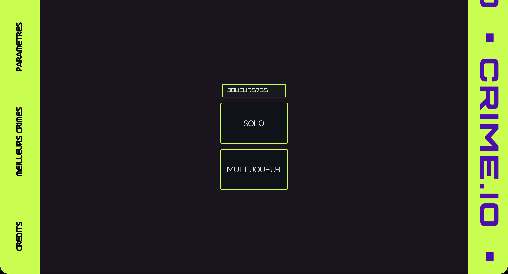
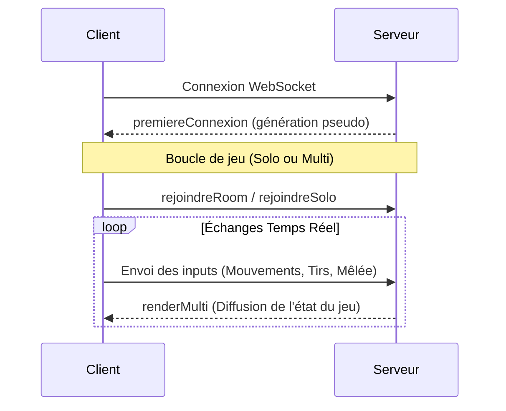

# Crime.io

Un jeu de tir (Joueur contre Bot) jouable sur navigateur, développé entièrement en TypeScript.



## Description

Crime.io est un jeu d'action et de tir en arène où le joueur doit survivre face à des bots. Le jeu propose de l'action rapide et des mécaniques évolutives :
* **Survie et Difficulté :** Affrontez des bots de plus en plus redoutables (vitesse accrue, apparition de boucliers EMP).
* **Mécaniques de combat :** Utilisez des tirs à distance, une attaque de mêlée pour briser les défenses ennemies, et un système de parade (*parry*) stratégique.
* **Multijoueur et Solo :** Jouez seul ou rejoignez des salons (rooms) pour jouer à plusieurs.

## Analyse Technique & Architecture

Ce projet a été conçu avec une forte volonté de maintenir un code robuste, typé de bout en bout, et une architecture réseau performante en temps réel.

* **Full-Stack TypeScript :** Utilisation exclusive de TypeScript pour le client et le serveur, garantissant un typage strict et un partage d'interfaces entre le front et le back.
* **Architecture Client/Serveur (WebSocket) :** Mise en place d'une communication bidirectionnelle avec Socket.io pour gérer les instances de parties via un système de "Rooms".
* **Moteur de Rendu Custom :** Utilisation de HTML5 Canvas avec une gestion dynamique du redimensionnement et un calcul précis des collisions (hitboxes et trajectoires).
* **Synchronisation d'État :** Le serveur gère la logique principale (Authoritative Server) et diffuse l'état complet du jeu aux clients pour assurer une parfaite synchronisation multijoueur.



## Fonctionnalités

* Jeu de tir fluide jouable directement dans le navigateur.
* Système de combat complet : tirs, mêlée chargée et parade (bouclier de 1.5s).
* Difficulté progressive des bots.
* Apparition de bonus tactiques (Invisibilité, Multi-bullets, Vitesse, HP supplémentaires).
* Système de Rooms pour les parties multijoueur.

## Technologies utilisées

* **Langages & Frontend :** TypeScript, HTML5 Canvas, CSS
* **Backend & Réseau :** Node.js, Socket.io (WebSocket)
* **Design :** Figma

## Installation et Exécution

**Environnement requis :** Node.js (v16 ou supérieur) et npm.

**1. Clonez le dépôt :**
```bash
git clone [lien_du_repo_github]
```

**2. Installez les dépendances :**
```bash
npm install
```

**3. Lancez l'application :**
```bash
npm run dev
# ou la commande que vous utilisez pour lancer le serveur
```

## Structure du projet

```
/
├── src/
│   ├── client/          # Code source Frontend (Rendu Canvas, Inputs)
│   ├── server/          # Code source Backend (Logique de jeu, Sockets)
│   └── shared/          # Types et logiques partagés (TypeScript)
└── public/              # Ressources statiques (images, css)
```

## Auteurs

- Ethan Seulin
- Ylann Wattrelos
- Adam Stievenard

## Licence et Documentation additionnelle

Ce projet est sous licence MIT.

* [Voir la maquette Figma du projet](https://www.figma.com/design/NtCrYoV48QG4gA1IYktlMD/maquette?node-id=0-1&p=f&t=I1PpPJhCa9w2e3yW-0)
