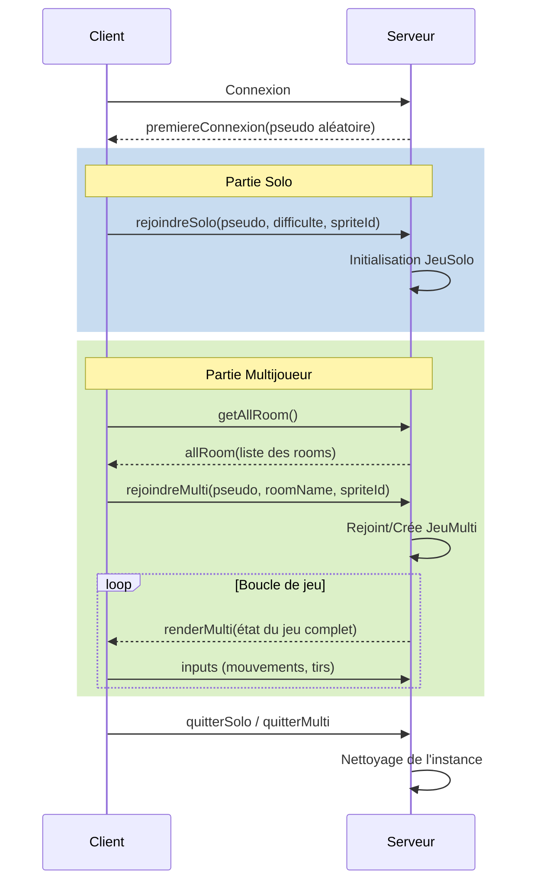

# Crime.io

## Membres

- Ethan Seulin
- Ylann Wattrelos
- Adam Stievenard

## Infos

- **Progression difficultés :**
  - plus move speed
  - plus bullet speed
  - bot avec EMP shield (bloque les balles + à implémenter avec l'update de la mélée)

- **Bonus :**
  - metal skin (pas de bullet damage à la Deadlock mais pas possible de parry)
  - invisibilité (mais impossible d'infliger des damages)
  - multi bullets
  - bonus bullet speed
  - bonus HP

## Milestones

- **V0,1 :**
  - génération des ennemis
  - perso movable
  - maquette
  - vues sans css
- **V0.2 :**
  - actifs de perso
  - gestion des dégâts
  - gestion des tirs
  - gestion de la vie
  - fonction rejouer
  - ajout des difficultés
- **V0.3 :**
  - ajout des bonus
  - mêlée
  - parry
  - sauvegarde des stats
  - highscore
  - crédits classiques
- **V0.4 :**
  - inventaire / perso (à voir on fait quoi)
  - skins
  - menu genre rétro futuriste UI
  - musique
- **V0.5 _(milestone bonus)_ :**
  - case opening
  - color palette thèmes
  - ajout de musique perso
  - implémentation de l'api de spotify (si on peut faire des bon trucs avec)
  - crédits : page steam de chacun de nous grâce à l’api, ou un truc du genre

## Idées pour le projet

### Mélée / parry

> Le système de mélée est un coup à charger légèrement et qui permet de mettre des dégats aux enemies qui ne peuvent pas être touché à distance (metal skin, bot avec EMP shield)  
> Il peut être chargé en mm tps que d'autres actions  
> Il peut être counter par un parry, qui est un "mur" autour du joueur qui dure 1.5s et qui root la personne qui initie le parry  
> Semblable dans l'idée au parry de deadlock  
> Possible de le move dans le V0.4 ou V0.5  

### Inventaire / Perso

> Soit on fait un inventaire qui permet de choisir son bonus, skin  
> Ca permet un une meilleure personalisation  
>
> Soit on fait des perso qui ont des bonus et un skin prédéfini  
> Ca permet un une lisibilitée dans les stuffs et possibilitées des autres.  

## TODO

- Faires les issues

## Rapport de Projet

### Diagrammes de séquence

#### Échanges WebSocket (Client/Serveur)

### Difficultés techniques rencontrées

- **Synchronisation en Temps Réel :** Le défi majeur a été de maintenir une fluidité de mouvement et une détection de collision cohérente pour tous les joueurs en mode multijoueur.
- **Gestion des Coordonnées et du Redimensionnement :** Adapter le canvas à différentes tailles d'écran tout en assurant que les positions des entités et les trajectoires des balles restent précises a nécessité une refactorisation du moteur de rendu.
- **Stabilité du Serveur :** Gérer proprement le cycle de vie des parties (création, join, déconnexion) pour éviter les fuites de mémoire et les états incohérents lors des déconnexions brutales.

### Points d'amélioration et d'achèvement

- **Support Mobile :** Adaptation de l'interface et des contrôles pour une jouabilité sur smartphones.
- **Système de Progression :** Ajout d'un système d'XP, de niveaux et d'un inventaire pour permettre une personnalisation plus poussée.
- **Contenu Additionnel :** Implémentation d'un mode PvP dédié, d'une mini-map et de nouveaux types d'ennemis avec des comportements variés.
- **Qualité de Code :** Augmentation de la couverture de tests unitaires et d'intégration.

### Ce dont nous sommes les plus fiers

- **Architecture Multijoueur :** Avoir réussi à mettre en place un système de "rooms" robuste avec Socket.io permettant une expérience fluide et interactive.
- **Mécaniques de Jeu :** L'implémentation de mécaniques avancées comme le "parry" et la mêlée, inspirées de jeux modernes, qui ajoutent une couche stratégique au gameplay.
- **Identité Visuelle :** Le style rétro-néon cohérent, soutenu par des sprites personnalisés et une interface utilisateur travaillée.

## plus

[figma](https://www.figma.com/design/NtCrYoV48QG4gA1IYktlMD/maquette?node-id=0-1&p=f&t=I1PpPJhCa9w2e3yW-0)